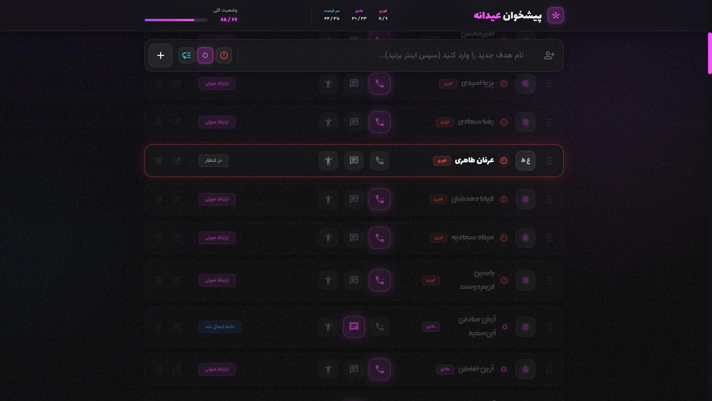

# Nowruz Greeting Dashboard | Advanced Neon Edition 🚀

A sleek, interactive Single Page Application (SPA) designed to help you organize and track your New Year (Nowruz) greetings. This dashboard combines high-end "Cyber-Neon" aesthetics with practical task management features.



## ✨ Key Features

- **🎯 Priority System:** Categorize targets into three levels: Urgent (High), Regular (Medium), and Casual (Low).
- **🛡️ Duplicate Protection:** Built-in logic to prevent adding duplicate entries to your list.
- **🔍 Live Search & Filter:** Instantly find contacts and filter by status or priority.
- **↕️ Drag & Drop Sorting:** Custom-built sorting mechanism to reorder your mission list manually.
- **💾 Persistent Storage:** Integrated with `localStorage` to keep your data safe even after a browser refresh.
- **📥 I/O Capabilities:** Export your full database as a JSON file or import existing backups seamlessly.
- **🎨 Cyber-Neon UI:** A beautiful, responsive dark-mode interface built with Tailwind CSS and glassmorphism effects.
- **🌍 Full RTL Support:** Specifically optimized for Persian (Farsi) typography and layout.

## 🛠️ Built With

- **HTML5** - Semantic structure.
- **Tailwind CSS** - Modern utility-first styling.
- **Vanilla JavaScript (ES6+)** - Core logic, state management, and DOM manipulation.
- **Material Symbols** - High-quality iconography.

## 🚀 How to Use

1.  **Clone the repo:**
    ```bash
    git clone https://github.com/Mahdi0Jafari/Nowruz-Greeting-Dashboard.git
    ```
2.  **Open `index.html`** in any modern web browser.
3.  **Add your targets:** Type a name, select a priority, and hit Enter.
4.  **Mark progress:** Click on call, message, or meet icons to update your status.

## 📈 Roadmap

- [ ] Add "Confetti" celebration effect on 100% completion.
- [ ] Implement categorized tabs for different social groups.
- [ ] Add a "Global Reset" button for annual resets.

## 📄 License

This project is open-source and available under the [MIT License](LICENSE).

---

Developed with ❤️ by **Mahdi Jafari**
